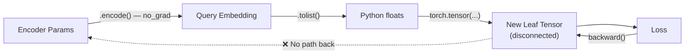
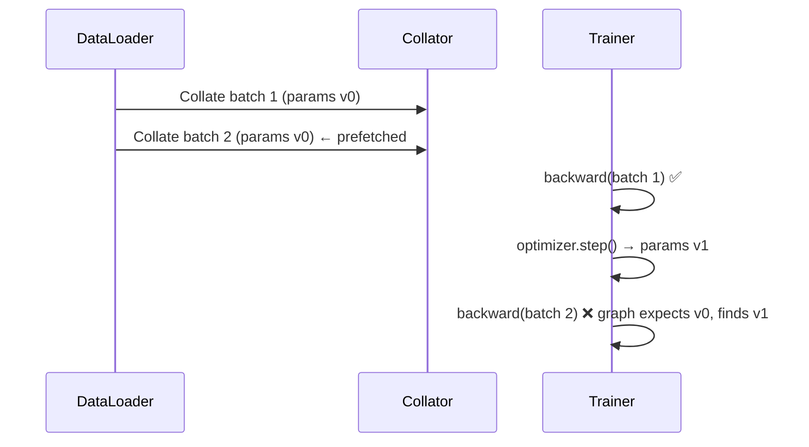

# Postmortem: LSR Training — Gradient Flow & Weight Update Failures

## Executive Summary

The retriever's weights were **not updating** during centralized LSR training despite training completing without errors. Three independent bugs in the gradient pipeline were identified and fixed. An additional issue blocked federated training (missing [ray](file:///Users/abishekchakravarthy/FInal_year_project/fed-rag/zz_coderuns/baseline/federated_lsr.py#74-81) dependency). All issues are now resolved.

---

## Part 1: Centralized Training

### Symptom

Running [baseline_training1.py](file:///Users/abishekchakravarthy/FInal_year_project/fed-rag/zz_coderuns/baseline/baseline_training1.py) produced:
```
🔎 HASH BEFORE TRAINING: 9db17c8aa125...
🔎 HASH AFTER TRAINING:  9db17c8aa125...   ← identical
📏 Weight Update L2 Norm: 0.0
❌ Retriever weights did NOT change
```

Training loss was reported, but the retriever's parameters were never updated.

### Root Causes (3 bugs)

Three bugs formed a chain that completely broke gradient flow from the loss back to the retriever encoder:

---

#### Bug 1 — Gradient Graph Severed in the Data Collator

**File:** [data_collators/huggingface/lsr.py](file:///Users/abishekchakravarthy/FInal_year_project/fed-rag/src/fed_rag/data_collators/huggingface/lsr.py)

The original `DataCollatorForLSR.__call__()` retrieved documents via `rag_system.retrieve()`, which internally:

1. Called `SentenceTransformer.encode()` — runs under `torch.no_grad()`, producing **detached** tensors
2. Called `.tolist()` on the query embedding in [_synchronous.py](file:///Users/abishekchakravarthy/FInal_year_project/fed-rag/src/fed_rag/core/rag_system/_synchronous.py), converting tensors to Python floats
3. Called `.tolist()` on similarity scores in [in_memory.py](file:///Users/abishekchakravarthy/FInal_year_project/fed-rag/src/fed_rag/knowledge_stores/in_memory.py)

The collator then wrapped these plain floats in a **new leaf tensor**:

```python
# ❌ BROKEN — creates a disconnected leaf tensor
retriever_scores = torch.tensor(
    [n.score for n in source_nodes], requires_grad=True
)
```

This tensor could accumulate its own gradients, but had **zero connection** to the encoder's parameters. Backpropagation through this tensor updated nothing.



---

#### Bug 2 — DataLoader Prefetch Invalidated Computation Graph

After fixing Bug 1 by re-computing retrieval scores differentiably *inside the data collator*, a new error appeared on training step 2:

```
RuntimeError: one of the variables needed for gradient computation
has been modified by an inplace operation: [MPSFloatType [384]]
is at version 2; expected version 1 instead.
```

**Cause:** The DataLoader prefetches the next batch while the current batch is training. Both batches' computation graphs referenced the encoder's parameters at the *same version*. After `optimizer.step()` modified the parameters in-place on batch 1, batch 2's graph became stale.



**Fix:** Move the differentiable forward pass from the data collator into [compute_loss()](file:///Users/abishekchakravarthy/FInal_year_project/fed-rag/src/fed_rag/trainers/huggingface/lsr.py#79-126), which runs during `training_step` — after each batch is individually fetched.

---

#### Bug 3 — Optimizer Had Zero Parameters

Even with correct gradients (verified via manual `backward()` + `step()`), `trainer.train()` still didn't update weights. The HuggingFace Trainer's optimizer contained **0 parameters**.

**Cause:** [SentenceTransformerTrainer](file:///Users/abishekchakravarthy/FInal_year_project/fed-rag/src/fed_rag/trainers/huggingface/lsr.py#30-34) [overrides](file:///Users/abishekchakravarthy/FInal_year_project/fed-rag/venv/lib/python3.12/site-packages/sentence_transformers/trainer.py) `get_optimizer_cls_and_kwargs()` to build optimizer param groups from `loss_model.named_parameters()` — i.e., the **loss module**, not the model. Since [LSRLoss](file:///Users/abishekchakravarthy/FInal_year_project/fed-rag/src/fed_rag/loss/pytorch/lsr.py#24-65) is pure math (KL divergence) with **no trainable parameters**, both optimizer groups were empty.

In `Trainer.create_optimizer()`:
```python
# ❌ This overwrites the correctly-built 103-param groups with empty groups
if "optimizer_dict" in optimizer_kwargs:
    optimizer_grouped_parameters = optimizer_kwargs.pop("optimizer_dict")
    # optimizer_dict came from SentenceTransformerTrainer with 0 params!
```

**Fix:** Override [create_optimizer()](file:///Users/abishekchakravarthy/FInal_year_project/fed-rag/src/fed_rag/trainers/huggingface/lsr.py#128-163) in [LSRSentenceTransformerTrainer](file:///Users/abishekchakravarthy/FInal_year_project/fed-rag/src/fed_rag/trainers/huggingface/lsr.py#46-163) to build optimizer groups from `self.model.named_parameters()` instead of relying on the parent's loss-based grouping.

---

### Final Fix Summary — Centralized Training

Two files were modified:

#### [data_collators/huggingface/lsr.py](file:///Users/abishekchakravarthy/FInal_year_project/fed-rag/src/fed_rag/data_collators/huggingface/lsr.py)

The collator now returns **raw data** (queries, context texts, LM scores) instead of computing retrieval scores. No differentiable operations happen here.

```diff
 # BEFORE: computed retrieval scores (broken gradient chain)
-retriever_scores = torch.tensor([n.score for n in source_nodes], requires_grad=True)
-return {"retrieval_scores": retrieval_scores, "lm_scores": lm_scores}

 # AFTER: returns raw data for compute_loss to handle
+return {"queries": batch_queries, "context_texts": batch_context_texts, "lm_scores": lm_scores}
```

#### [trainers/huggingface/lsr.py](file:///Users/abishekchakravarthy/FInal_year_project/fed-rag/src/fed_rag/trainers/huggingface/lsr.py)

Two methods were added/rewritten in [LSRSentenceTransformerTrainer](file:///Users/abishekchakravarthy/FInal_year_project/fed-rag/src/fed_rag/trainers/huggingface/lsr.py#46-163):

1. **[compute_loss()](file:///Users/abishekchakravarthy/FInal_year_project/fed-rag/src/fed_rag/trainers/huggingface/lsr.py#79-126)** — performs the differentiable forward pass (query encoding → cosine similarity with context embeddings → KL divergence loss). Runs during `training_step`, avoiding the prefetch issue.

2. **[create_optimizer()](file:///Users/abishekchakravarthy/FInal_year_project/fed-rag/src/fed_rag/trainers/huggingface/lsr.py#128-163)** — builds optimizer param groups from `self.model.named_parameters()` (103 trainable params), bypassing [SentenceTransformerTrainer](file:///Users/abishekchakravarthy/FInal_year_project/fed-rag/src/fed_rag/trainers/huggingface/lsr.py#30-34)'s broken loss-based grouping.

### Verified Result

```
🔎 HASH BEFORE: 9db17c8aa125359008dd09ea8e4d40b7
🔎 HASH AFTER:  cd6a27224a89d1c619cb453f16a54f2a
📏 Weight Update L2 Norm: 0.42397934
✅ Retriever weights updated successfully.
```

---

## Part 2: Federated Training

### Symptom

The existing [federated_lsr.py](file:///Users/abishekchakravarthy/FInal_year_project/fed-rag/zz_coderuns/baseline/federated_lsr.py) used `fl.simulation.start_simulation()`, which requires the [ray](file:///Users/abishekchakravarthy/FInal_year_project/fed-rag/zz_coderuns/baseline/federated_lsr.py#74-81) package. This was not installed:

```
ImportError: Unable to import module `ray`.
```

### Fix

Rewrote [federated_lsr.py](file:///Users/abishekchakravarthy/FInal_year_project/fed-rag/zz_coderuns/baseline/federated_lsr.py) to use a **manual FedAvg simulation** — no [ray](file:///Users/abishekchakravarthy/FInal_year_project/fed-rag/zz_coderuns/baseline/federated_lsr.py#74-81) dependency needed. The script:

1. Initializes a global model
2. For each round:
   - Creates fresh clients, each loading the current global weights
   - Each client trains locally on its disjoint data split
   - Collects updated weights from all clients
   - Aggregates via **weighted averaging** (FedAvg)
3. Broadcasts the new global weights for the next round

This directly exercises the same training pipeline (data collator → compute_loss → optimizer) that was fixed for centralized training.

### Verified Result

```
📡 ROUND 1/3
  Client 0: Loss 0.039  Weights changed ✅
  Client 1: Loss 0.016  Weights changed ✅
📡 ROUND 2/3
  Client 0: Loss 0.016  Weights changed ✅
  Client 1: Loss 0.002  Weights changed ✅
📡 ROUND 3/3
  Client 0: Loss 0.005  Weights changed ✅
  Client 1: Loss 0.001  Weights changed ✅

Initial hash: 9db17c8aa125359008dd09ea8e4d40b7
Final hash:   eeff86faeafd5e50ad6e261c0c6a66e7
✅ Weights changed
```

Losses decreased monotonically across rounds for both clients, confirming federated aggregation and local training are both working correctly.

---

## Files Changed

| File | Change |
|------|--------|
| [lsr.py](file:///Users/abishekchakravarthy/FInal_year_project/fed-rag/src/fed_rag/data_collators/huggingface/lsr.py) (collator) | Returns raw data instead of computing retrieval scores |
| [lsr.py](file:///Users/abishekchakravarthy/FInal_year_project/fed-rag/src/fed_rag/trainers/huggingface/lsr.py) (trainer) | Added [compute_loss()](file:///Users/abishekchakravarthy/FInal_year_project/fed-rag/src/fed_rag/trainers/huggingface/lsr.py#79-126) with differentiable forward pass + [create_optimizer()](file:///Users/abishekchakravarthy/FInal_year_project/fed-rag/src/fed_rag/trainers/huggingface/lsr.py#128-163) with correct param groups |
| [federated_lsr.py](file:///Users/abishekchakravarthy/FInal_year_project/fed-rag/zz_coderuns/baseline/federated_lsr.py) | Rewrote to use manual FedAvg simulation (no Ray) |
