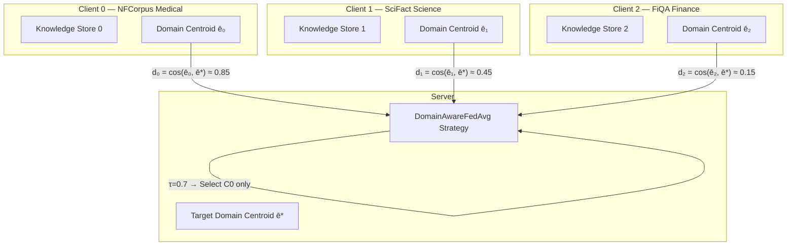

# DAS-FedAvg Implementation Plan

## Goal

Implement **Domain-Aware Selective FedAvg (DAS-FedAvg)** — a federated strategy that computes domain relevance scores for each client and only selects domain-relevant clients for aggregation. This addresses the *domain dilution* problem where cross-domain weight updates degrade the target-domain retriever.

---

## Architecture Overview



---

## Experimental Setup

### Client-Domain Assignment

| Client | BEIR Dataset | Domain | Role |
|--------|-------------|--------|------|
| **0** | NFCorpus | Medical/Nutrition | **Target-relevant** |
| **1** | SciFact | Scientific Claims | Partially relevant (science ∩ medical) |
| **2** | FiQA-2018 | Finance Q&A | **Completely irrelevant** |

### Target Domain

- **Target**: NFCorpus (medical)
- **Evaluation set**: NFCorpus validation query-response pairs
- **Target centroid**: Mean embedding of NFCorpus eval queries

### Per-Client Resources

| Resource | Value |
|----------|-------|
| Training pairs per client | ~200-500 (depends on dataset) |
| Knowledge store docs per client | ~500-1000 |
| Local epochs per round | 2 |
| Federated rounds | 5 |
| Batch size | 8 |

### τ Sweep

| τ | Expected Selection | Rationale |
|---|-------------------|-----------|
| **0.0** | All 3 clients | Baseline — standard FedAvg with full participation |
| **0.2** | C0 + C1 (maybe C2) | Mild filtering |
| **0.4** | C0 + C1 | Moderate — removes finance |
| **0.6** | C0 + C1 | Aggressive — only science and medical |
| **0.8** | C0 only | Very aggressive — medical only |

---

## Proposed Changes

### File Structure

```
zz_coderuns/das_fedrag/
├── prepare_multi_domain_data.py    [NEW]  Data loading for 3 BEIR domains
├── domain_aware_fedavg.py          [NEW]  DAS-FedAvg Flower strategy
├── federated_das.py                [NEW]  Main experiment runner
├── run_tau_sweep.py                [NEW]  τ sweep orchestrator
├── compile_tau_results.py          [NEW]  Results compiler + plots
├── single_tau_kaggle_colab.ipynb   [NEW]  Kaggle notebook
├── output_csv_files/               [NEW]  Results CSVs
└── output_log_files/               [NEW]  Logs
```

---

### Component 1: Multi-Domain Data Pipeline

#### [NEW] [prepare_multi_domain_data.py](file:///Users/abishekchakravarthy/FInal_year_project/fed-rag/zz_coderuns/das_fedrag/prepare_multi_domain_data.py)

Loads 3 BEIR datasets independently, builds per-client knowledge stores, and computes domain centroids.

**Key functions:**

```python
def load_client_data(dataset_name, max_train, max_eval, max_docs, seed):
    """Load one BEIR dataset → returns {retriever, knowledge_store, 
    train_pairs, eval_pairs, doc_lookup, domain_centroid}."""
    # 1. Load BEIR dataset (reuse load_beir_dataset pattern)
    # 2. Build train/eval pairs
    # 3. Create retriever
    # 4. Build knowledge store (per-client, NOT shared)
    # 5. Compute domain centroid: mean of all knowledge store embeddings
    #    centroid = np.mean([node.embedding for node in store], axis=0)
    # 6. Return everything + centroid

def compute_target_centroid(retriever, eval_pairs):
    """Compute target domain centroid from eval query embeddings.
    target_centroid = mean of retriever.encode_query(q) for q in eval_queries."""

def setup_multi_domain_experiment(client_configs, target_dataset, seed):
    """Orchestrates: loads all client datasets, computes all centroids,
    computes domain relevance scores d_j = cos(client_centroid, target_centroid)."""
```

**Domain centroid math:**
$$\bar{\mathbf{e}}_j = \frac{1}{|S_j|}\sum_{d \in S_j} \mathbf{e}_d$$

> [!IMPORTANT]
> Each client's knowledge store is built using a **fresh retriever instance** (same model weights, different knowledge store contents). The embeddings in the knowledge store are computed at init time using the **pre-trained** encoder — they are not updated during FL training.

---

### Component 2: DAS-FedAvg Strategy

#### [NEW] [domain_aware_fedavg.py](file:///Users/abishekchakravarthy/FInal_year_project/fed-rag/zz_coderuns/das_fedrag/domain_aware_fedavg.py)

A Flower strategy that extends [FedAvg](file:///Users/abishekchakravarthy/FInal_year_project/fed-rag/zz_coderuns/quality_aware_fedrag/quality_aware_fedavg.py#16-215) with domain-aware client selection.

**Key design:**

```python
class DomainAwareFedAvg(FedAvg):
    def __init__(self, tau, client_relevance_scores, min_selected=1, ...):
        # tau: selection threshold
        # client_relevance_scores: {cid: float} pre-computed cosine sims
        # min_selected: fallback minimum (take top-k if threshold too strict)

    def configure_fit(self, server_round, parameters, client_manager):
        """Override: only send training instructions to SELECTED clients."""
        # 1. Get all available clients from client_manager
        # 2. Filter: keep clients where d_j > tau
        # 3. Fallback: if fewer than min_selected, take top-k by relevance
        # 4. Return [(selected_client, FitIns)] pairs
        # 5. Log which clients were selected/excluded

    def aggregate_fit(self, server_round, results, failures):
        """Standard FedAvg aggregation (size-weighted) over SELECTED clients only.
        Plus: post-aggregation evaluation, diagnostics logging."""
```

**Domain relevance score:**
$$d_j = \cos(\bar{\mathbf{e}}_j, \bar{\mathbf{e}}^*) = \frac{\bar{\mathbf{e}}_j \cdot \bar{\mathbf{e}}^*}{\|\bar{\mathbf{e}}_j\| \cdot \|\bar{\mathbf{e}}^*\|}$$

**Client selection:**
$$S^t = \{j \mid d_j > \tau\} \quad \text{(with min-selected fallback)}$$

> [!NOTE]
> Unlike QA-FedAvg (which changed [aggregate_fit](file:///Users/abishekchakravarthy/FInal_year_project/fed-rag/zz_coderuns/quality_aware_fedrag/quality_aware_fedavg.py#54-215)), DAS-FedAvg's innovation is in `configure_fit` — it controls **which clients participate**, not how weights are combined. Aggregation itself remains standard FedAvg (w_j = n_j/N over the selected subset).

---

### Component 3: Experiment Runner

#### [NEW] [federated_das.py](file:///Users/abishekchakravarthy/FInal_year_project/fed-rag/zz_coderuns/das_fedrag/federated_das.py)

The main experiment script (equivalent to [federated_noisy_qa.py](file:///Users/abishekchakravarthy/FInal_year_project/fed-rag/zz_coderuns/quality_aware_fedrag/federated_noisy_qa.py) for QA-FedAvg).

**CLI args:**
```
--tau        float   Domain relevance threshold (default: 0.0)
--seed       int     Random seed (default: 42)
--rounds     int     Federated rounds (default: 5)
--local-epochs int   Local training epochs (default: 2)
--target     str     Target domain dataset (default: "nfcorpus")
```

**Flow:**

```
1. Load 3 BEIR datasets (nfcorpus, scifact, fiqa)
2. Build per-client knowledge stores
3. Compute domain centroids for all clients
4. Compute target centroid from eval queries
5. Compute domain relevance scores: d_j = cos(centroid_j, target_centroid)
6. Print relevance scores (this is a key diagnostic)
7. Pre-training evaluation on target domain
8. Create DomainAwareFedAvg strategy with tau and relevance scores
9. Run fl.simulation.start_simulation()
10. Post-aggregation evaluation after each round (on target domain)
11. Save results CSV, manifest JSON, acceptance JSON
```

**Client factory ([client_fn](file:///Users/abishekchakravarthy/FInal_year_project/fed-rag/zz_coderuns/baseline/federated_iid_lsr.py#121-187)):**
```python
def client_fn(cid: str):
    # Key difference from QA-FedAvg: each client has its OWN knowledge store
    knowledge_store = CLIENT_KNOWLEDGE_STORES[cid]
    # ... same RAG system setup, but with per-client store
```

**CSV schema:** Same audit-grade format as QA-FedAvg, plus:
- `client_{cid}_domain` — which BEIR dataset the client holds
- `client_{cid}_relevance` — pre-computed domain relevance score
- `client_{cid}_selected` — whether client was selected this round (0/1)
- `post_mrr`, `post_recall_at_k`, `post_ndcg_at_k` — post-aggregation eval on target domain

---

### Component 4: Sweep & Compilation

#### [NEW] [run_tau_sweep.py](file:///Users/abishekchakravarthy/FInal_year_project/fed-rag/zz_coderuns/das_fedrag/run_tau_sweep.py)

Runs `federated_das.py` for τ ∈ {0.0, 0.2, 0.4, 0.6, 0.8}, same pattern as [run_alpha_sweep.py](file:///Users/abishekchakravarthy/FInal_year_project/fed-rag/zz_coderuns/quality_aware_fedrag/run_alpha_sweep.py).

#### [NEW] [compile_tau_results.py](file:///Users/abishekchakravarthy/FInal_year_project/fed-rag/zz_coderuns/das_fedrag/compile_tau_results.py)

Compiles per-τ CSVs into summary plots:
- **τ vs Final MRR** — the money plot (should peak at moderate τ)
- **τ vs Final Loss** — mirror of MRR
- **Per-round loss curves** by τ
- **Client participation heatmap** — which clients participated at which τ

#### [NEW] [single_tau_kaggle_colab.ipynb](file:///Users/abishekchakravarthy/FInal_year_project/fed-rag/zz_coderuns/das_fedrag/single_tau_kaggle_colab.ipynb)

Same pattern as [single_alpha_kaggle_colab.ipynb](file:///Users/abishekchakravarthy/FInal_year_project/fed-rag/zz_coderuns/quality_aware_fedrag/single_alpha_kaggle_colab.ipynb). One notebook per τ value.

---

## Expected Results

### Domain Relevance Scores (Pre-computed, before training)

| Client | Domain | Expected d_j | Reasoning |
|--------|--------|-------------|-----------|
| 0 | NFCorpus (Medical) | **0.7–0.9** | Same domain as target → high cosine sim |
| 1 | SciFact (Science) | **0.3–0.5** | Some medical-adjacent terminology |
| 2 | FiQA (Finance) | **0.05–0.2** | Completely different vocabulary |

### Target-Domain MRR by τ

| τ | Clients Selected | Expected MRR trend |
|---|-----------------|-------------------|
| 0.0 | All three | **Low** — finance client dilutes the retriever |
| 0.2 | C0, C1 | **Higher** — finance excluded |
| 0.4 | C0, C1 | Similar to 0.2 |
| 0.6 | C0 possibly C1 | **Near peak** — mostly target-domain data |
| 0.8 | C0 only | **Slightly lower** — single client has limited data |

> [!IMPORTANT]
> The key result to demonstrate: **at τ=0.0 (all clients), the global model is worse on the target domain than at a moderate τ that excludes irrelevant clients.** This proves that domain-aware selection improves federated RAG.

---

## Verification Plan

### Automated Acceptance Tests (built into the script)

| Test | Condition |
|---|---|
| `tau_zero_selects_all` | At τ=0.0, all 3 clients participate every round |
| `high_tau_excludes_irrelevant` | At τ=0.6+, Client 2 (finance) is never selected |
| `relevance_scores_ordered` | d₀ > d₁ > d₂ (medical > science > finance) |
| `distinct_round_trajectories` | Model hash changes each round |

### Manual Verification

1. Run τ=0.0 and τ=0.6, compare final MRR on NFCorpus eval set
2. Verify domain relevance scores printed at start match expectations
3. Check that excluded clients have zero entries in the CSV for that round

### Post-Experiment Compilation

Run `compile_tau_results.py` on all downloaded CSVs to generate the summary plots for the final report.

---

## Kaggle Execution Plan

| Run | τ | Notebook | Estimated Time |
|-----|---|----------|----------------|
| 1 | 0.0 | `single_tau_kaggle_colab.ipynb` (modify τ) | ~40–60 min |
| 2 | 0.2 | Same notebook, change τ | ~30–50 min |
| 3 | 0.4 | Same notebook, change τ | ~30–50 min |
| 4 | 0.6 | Same notebook, change τ | ~25–40 min |
| 5 | 0.8 | Same notebook, change τ | ~15–25 min |

> [!NOTE]
> Higher τ values are faster because fewer clients train each round. At τ=0.8, only Client 0 participates — one-third of the work.

---

## Risk Factors

| Risk | Mitigation |
|------|-----------|
| FiQA may require different loading logic (larger dataset, different HF splits) | Test [load_beir_dataset("fiqa")](file:///Users/abishekchakravarthy/FInal_year_project/fed-rag/zz_coderuns/baseline/prepare_beir_data.py#17-52) locally first; fall back to ArguAna if FiQA is problematic |
| Per-client knowledge stores triple memory usage | Each store is ~500 docs × 384 floats = ~750KB — negligible |
| Domain centroids might not be discriminative enough | Print cosine sims before training; if domains are too close, switch to more divergent datasets |
| Single target-domain client undertrains at high τ | Use min_selected=1 fallback; accept this as a genuine limitation of aggressive filtering |
